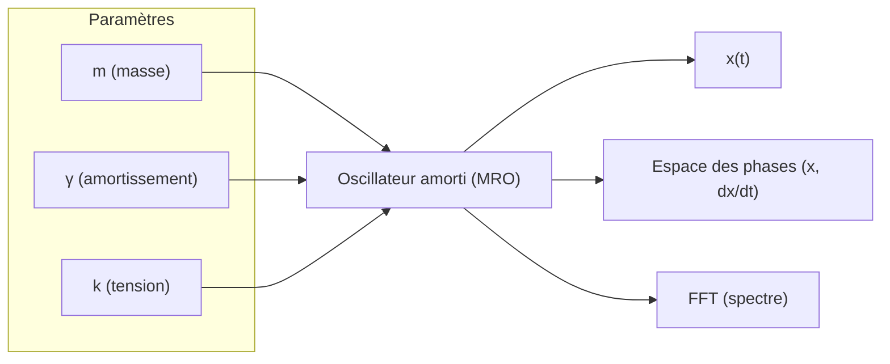
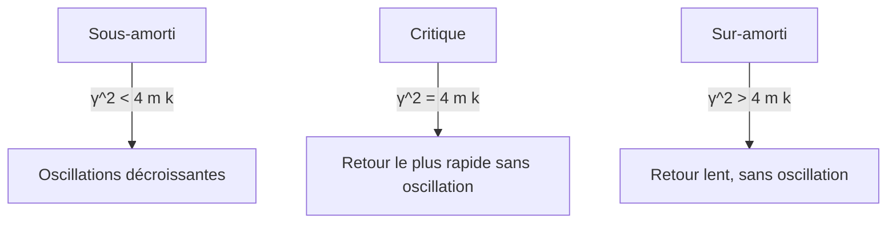

# Dashboard MRO – Modèle de Résonance Ontogénétique

[](https://opensource.org/licenses/MIT)
[](https://orcid.org/0009-0007-1822-5741)
[](https://epheverisme.art)
[](https://doi.org/10.22541/au.176175046.68446609/v1)

> **Une interface interactive open-source** pour explorer le **Modèle de Résonance Ontogénétique (MRO)** : une hypothèse dynamique reliant **mémoire, plasticité et émergence de forme** dans les systèmes vivants et symboliques.

---

## Démo en direct
[https://epheverisme.art](https://epheverisme.art)

---

## Objectifs

Ce tableau de bord permet de :

- Simuler des **oscillations amorties** (MRO)
- Explorer l’effet des paramètres `γ` (tension ontogénétique) et `k` (raideur)
- Visualiser les **trajectoires en espace des phases**
- Analyser le **spectre fréquentiel (FFT)**
- Cartographier la **dynamique globale** via heatmaps `(γ, k)`
- Comparer plusieurs configurations en superposition
- Exporter des **figures scientifiques prêtes à publier** (PNG, SVG, ZIP)
- Conduire des **expériences reproductibles**

> Idéal pour la **recherche conceptuelle**, l’**enseignement numérique** et la **communication scientifique**.

---

## Concepts théoriques

| Phénomène | Signature dans le MRO |
|---------|------------------------|
| **Information** | Contraction dans l’espace des phases |
| **Mémoire** | Déformation topologique progressive |
| **Plasticité** | Modulation lente des paramètres |
| **Ontogenèse** | Persistance structurelle de la résonance |
| **Dissipation constructive** | Inscription temporelle non triviale |

### Régimes dynamiques
- **Zone morte** (`γ → 0`) → aucune écriture
- **Zone dissipative** (`γ → ∞`) → extinction rapide
- **Bande vivante** → émergence d’histoire et de forme

---

## Fonctionnalités

| Fonctionnalité | Description |
|----------------|-----------|
| `x(t)` | Série temporelle avec amortissement |
| `(x, dx/dt)` | Espace des phases : spirales, attracteurs |
| `FFT` | Fréquence dominante extraite |
| `Heatmap (γ, k)` | Cartographie du pic d’amplitude |
| `Multi-tracés` | Comparaison de presets |
| `Export` | PNG HD, SVG vectoriel, ZIP + README |
| `Presets` | Configurations pré-enregistrées |

---

## Schémas explicatifs

### Schéma du modèle MRO (flux)



### Régimes dynamiques



---

## Installation (développement local)

```bash
git clone https://github.com/henissartj/Dashboard-MRO.git
cd Dashboard-MRO

python3 -m venv .venv
source .venv/bin/activate  # .venv\Scripts\activate sur Windows

pip install -r requirements.txt
python app.py
